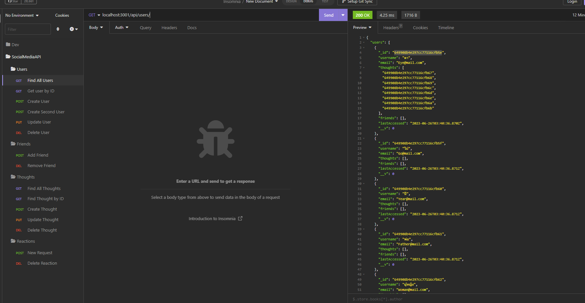

# Social Network API

This is a social network backend api with basic functionality that uses MongoDB as the database.

## Table of Contents

- [Installation](#installation)
- [Usage](#usage)
- [Support](#support)
- [Contributing](#contributing)

## Installation

Download the repository, run npm i, then run npm start. This requires mongoDB.
You will be able to hit the routes in insomnia as described in the usage section.

## Usage

GET

`localhost:3001/api/users/ - Gets all Users 

localhost:3001/api/users/:userId - Gets a user by their Id. 

localhost:3001/api/thoughts - Gets all thoughts. 

localhost:3001/api/thoughts/:thoughtId - Gets a thought by it's Id.`

POST

`localhost:3001/api/users/ - Creates a user when a json is sent with an email and a username. 

localhost:3001/api/users/:userId/friends/:friendId - Adds a user to your friends list by their Id.  

localhost:3001/api/thoughts - Creates a thought as long as a username and a thoughtText is passed through the JSON request. 

localhost:3001/api/thoughts/:thoughtId/reactions - adds a reaction to a thought. Accepts a username and a reactionBody, but they are not required. Empty thoughts go through. `

PUT

`localhost:3001/api/users/:userId - Updates a user by id with whatever's passed throught the JSON request. 

localhost:3001/api/thoughts/:thoughtId - Updates a thought by Id`

DELETE

`localhost:3001/api/users/:userId - Deletes a user and all their thoughts.  

localhost:3001/api/users/:userId/friends/:friendId - Delete's a friend from a users friends list by Id.  

localhost:3001/api/thoughts/:thoughtId - Deletes a thought by Id 

localhost:3001/api/thoughts/:thoughtId/reactions/:reactionId - Deletes a reaction from a thought by the id of both. `

[Demo video](https://drive.google.com/file/d/1_nvjkh_2PMq4J9SQS5XKGH1B7utw09GU/view): https://drive.google.com/file/d/1_nvjkh_2PMq4J9SQS5XKGH1B7utw09GU/view

